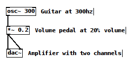
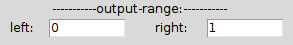
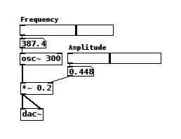

Digital Audio
=============

Sound hitting our ears is as continous as reality. Air compresses and rarefies smoothly.
Analog signals - like my voice for example - can be represented digitally by using a 
sensitive membrane connected to a transducer - you may know this device as a microphone - 
to sample these changes in pressure at a regular interval - is is the **sampling rate**.

Sampling Signals
================

The principle is the same when sampling from an analog audio signal, like the headphone 
output from an FM radio. The analog signal is a continuous voltage - just like the 
signal produced by the transducer in a microphone - you could pick any tiny point in 
time, and if you had good enough instruments, measure the value of the signal, and be able 
to track the tiniest of changes in the shortest intervals.

Once the audio has been sampled, what we actually have is a collection of numbers - specifically 
integers of a certain type - representing each instananious value of the signal. The range of these 
integers correlates to the dynamic range of the audio. 

Dynamic Range
=============

Lets say our range is between -100 and 100. If the speaker cone is pushed all the way out, 
the value is 100. If it is pulled all the way in, the value is -100. If it is at rest (and 
therefore silent) the value is 0. This means we have exactly 201 possible amplitudes to work 
with. (That extra 1 comes from the 0 value.)

[ diagram ]

This range doesn't affect **absolute** loudness - that is to say, if we had a range of -200 to 
200, the audio would not be twice as loud, but we would have almost twice the number of choices 
for amplitudes.

If we were writing music with western notation and we were limited to ppp, mf, and fff for 
dynamic markings, this would be the equivelant to working with a low bit depth in digital audio.
If we then wrote music using ppp, pp, p, mf, f, ff, and fff for dynamic markings, we haven't changed 
the **absolute** loudness of the music, but we've given ourselves more dynamic range.

The same is true for digital audio, but there are different consequences to audio with a limited bit depth.

Bit Depth & Binary Integers
===========================

Before I get into that, lets touch on why the dynamic range of digital audio is described in 
terms of bit depth. Earlier I mentioned that when we sample audio, what we actually end up is a collection 
of integers of a specific sort. What sort exactly depends precisely on the bit depth of the audio we're 
targeting. Computers store integers - and every other thing! - as a series of 1s and 0s as you probably know. 

Each of those 1s or 0s is called a bit. If we only needed to store 2 possible values, we could just use a single 
bit. So, the number 1 would be:

::

    1
    
How about the number 3? We need to add a bit to give us more possible values. Using two bits, here is our 1 again:

::

    0 1

The farthest bit to the right (this is called little-endian format fwiw, in reverse it's big-endian) is the ones 
column - so 0 is 0 and 1 is 1 - but our new bit is the twos column: 0 is 0 and 1 is 2.

To store a three in binary, we'd write these bits into the computer's memory:

::

    1 1

Adding it up from left to right, we have a value of 2 and a value of 1, and now we have our 3!

Using two bits to store each sampled number in a digital audio stream means we would have a bit depth of 
2, and exactly 4 possible dynamics for our audio.

And how about 9? Add two more bits. These will represent the 4s and 8s columns - because this is a base 2 system, 
each additional bit is 2 to the power of its column index. So counting from 0 from the right to the left, lowest to 
highest: 

.. math::

    2^0 = 1

    2^1 = 2

    2^2 = 4

    2^4 = 8

That means we can store nine by setting 4 bits like this:

::

    1 0 0 1

Five: 1 eight plus 0 fours plus 0 twos plus 1 one.

Now we're working with 4 bit numbers!

Quantization Noise
==================

Okay, we can finally get to pure data. Lets listen to how 4 bit audio sounds by sampling my voice with pure data 
using only the 8 possible values in a 4 bit integer. Here's a graph of what a sinewave recorded at this bit depth 
would look like:

[ graph ]

You can see discontinuities where the audio makes huge jumps between values. As a general rule, 
sounds with rougher and more angular shapes have a richer timbre, with more energy in the upper partials. These 
jumps are just about as extreme as you can get in digital audio, so at those moments of transition the sound has 
a lot of energy across the frequency spectrum. This is known as quantization noise.

Data in Pure Data
=================

I think one of the most difficult hurdles to leap during the initial learning curve with pure data is learning to 
understand how it handles and understands data in your patches. Initial frustrations can often be traced back to 
questions related to data flow - for example:

 - How does information flow around the program? 
 - What different kinds of information are there? 
 - How does each kind of information behave? 
 - How do I convert one kind of information into another kind?

I'll try to provide the tools to discover the answers to these questions when they pop up in unfamiliar places.

Objects and Abstractions
========================

The basic building block in pd is the object. Objects are very much like little highly specialized software guitar pedals.
Some objects come with pd itself. If you downloaded the 'vanilla' version of pd, you will have a more minimal but very 
powerful set of objects. If you downloaded Pd extended, you will get a number of additional libraries of objects as well.
You can download additional objects that other people have made and use them alongside the built in objects. You can also 
use your own patches as though they were themselves objects. We'll come back to that later.

Inlets, Outlets and Data Types
==============================

Objects have inputs and outputs, which you can use to connect them to one another and create a signal path. Where you'd have an 
amplifier at the terminating end of the signal path if you were hooking up some guitar pedals, in pd that end point is the 
``[ dac~ ]`` object. (There are other ways to get data in and out of pd - but for the purposes of this workshop I'll stick to 
audio.) The ``[ dac~ ]`` object is an interface to your audio hardware. It has up to as many inlets as your soundcard has 
channels - so typically there are two inlets: one for the left channel and one for the right.

If we wanted to mimic the signal path of a guitar plugged into a volume pedal, which is in turn plugged into an amplifier, in 
pure data we could create a simple patch with three objects. 

   It doesn't sound much like a guitar, but you can imagine this simple patch as being like a 
   guitarist plugging his guitar into a volume pedal, and the volume pedal into a stereo amplifier.

As the guitar, we can start with an ``[ osc~ 300 ]`` object. ``[ osc~ ]`` and ``[ dac~ ]`` are both signal rate objects. Every signal rate object has 
a tilde at the end of its name by convention. Signal rate objects do their work very fast. Their speed correlates to the sampling 
rate you've chosen for your soundcard. Lets assume we're using a sampling rate of 44,100 samples every second, and a bit depth of 
16 bits - in other words, cd quality audio.

Sampling & Signal Rate Objects
==============================

Sampling is a concept that will constantly come up in working with digital audio. In different contexts it has specific meanings and 
can sometimes be confusing, but the basic concept is very simple. Sampling is the process of picking a number out of a stream of numbers 
in order to represent that stream at a given point in time. In other words, it is a sample of the value of a signal at a certain time.

The sampling rate for an audio system then just tells us how many samples the system will take in one second.
Given the settings we decided on for the guitar example above, we could guess that every 1/44100th of a second 
a signal rate pd object would get a new number in one of its inlets, do something with it, and spit a new number out to one of its outlets.
Actually, computation happens in small blocks of numbers. You can change the size of this block, but the default is usually 64 samples.
So every 64/44100ths of a second - or about 1.45 milliseconds - pure data will process a block of 64 samples and schedule them for playback. 
(Miller97_, PdMemoryModel_) During that 64 sample block, the entire signal chain is calculated. Signal rate objects are constantly being evaluated as long as DSP is 
on in pd.

While the DAC is on, every 1.45 milliseconds, pd figures out the next 64 values it should send to the ``[ dac~ ]`` all at once.

Control Rate Objects
====================

Lets add some GUI objects so we can control our patch interactively. The ``[ hslider ]`` and ``[ vslider ]`` objects are sliders you 
can drag with the mouse to send the corresponding value in a given range to the slider's outlet. To make this volume pedal ``[ *~ ]`` 
object more like a volume pedal, we have to have a way to change its value whenever we want. One way to do this is with an ``[ hslider ]``
GUI object. 

   
   Adding a couple ``[ hslider ]`` s and number boxes for interactivity.

Try using the mouse to change the amplitude hslider very fast. The zippering sound you hear is the result of the same 
type of discontinuity we saw with quantization noise. Control rate objects only update once every DSP tick - in this case 
every 1.45ms - and so the ``[ *~ ]`` will hold its value for the duration of each 64 sample tick, and jump to the currently 
sampled value from the ``[ hslider ]`` on each subsequent tick.

Zipper noise with control rate driven signal objects.

The rest of this workshop will build on and continue to revisit the fundementals touched on above, but now we're going to get into 
practical examples of use and build a little software instrument together.

Signal math

expr~

s/r/s~/r~/throw~/catch~ and routing

Adc~ and recording into tables

Using tables for playback

Loading a sound into a table

Random numbers

Advanced table playback

Abstractions

Resources
=========

- http://puredata.info The official site. Download PD here and find tons of links to patches and documentation.
- http://puredata.hurleur.com The PD forum. A great place to ask questions, share patches, and generally nerd out about PD.
- http://en.flossmanuals.net/pure-data/ Probably the most readable overview of Pure Data out there, this open source book is 
always being updated and expanded.

Citations
=========

.. [Miller97] http://puredata.info/docs/articles/puredata1997
.. [PdMemoryModel] http://puredata.info/docs/developer/PdMemoryModel/view

